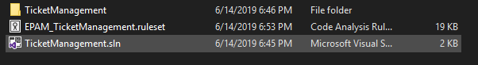
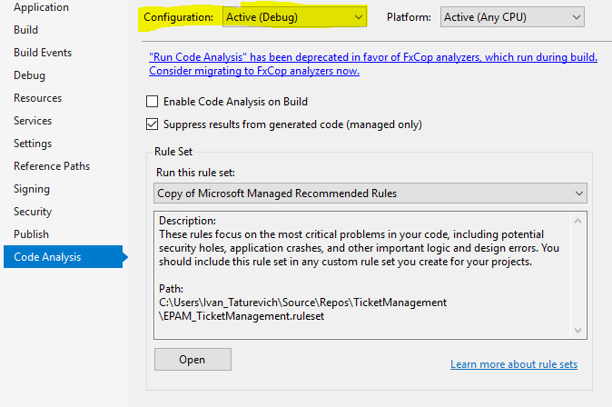
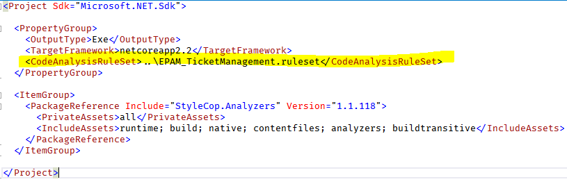

# StyleCop setup guide for .NET projects

## Reason

Good code base should have consistent and approved code style, which all team members and code maintainers should follow.  
It makes code more readable and structured.  
This usually achieved via different code analysis tools, linters etc.  
One of the most commonly used tool in .NET ecosystem for it is StyleCop

## How to Setup

1. Install StyleCop.Analyzers into each project (.csproj) in your solution.

2. Download **EPAM_TicketManagement.ruleset** file and place it near your solution file

3. Set path to ruleset file for each project in solution.  
For full .net framework projects (4.7.2 for example) right click on project -> properties -> Code Analysis  
Select configuration file which your just copied to your solution.

Set same ruleset file for Debug and Release configuration.
For .net core and netstandard projects right click on project file -> Edit Project File  
Add relative path to ruleset as a property under property group:

## Expected Result

If all previous steps were completed you will observe solution analysis in action:

Also you will see additional warning during build of your soluton.  
Set StyleCop ***for each project*** in your solution and try to fix all warnings which it shows.  
Make this setup ***before writing of the actual code***.  
In that way you will save a lot of time and efforts.
