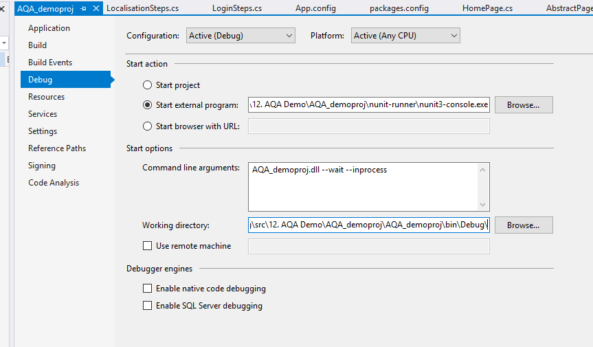

To run these test you need to build solution in debug first. After that you should open **cmd** in root folder and run ***run-tests.bat***.
If you have ReSharper or Rider you can run this tests right from IDE. In case of Visual Studio you may not succeed, because they have a lot of bugs in their test tolling nowadays.
In that case use bat file to start your test execution.

If you want to debug your tests in Visual Studio, you could set debug mode for visual studio manually:

Alternatively you could install extension for VS called ***Testdriven.NET***.
It has option Test with -> Debugger in context menu.